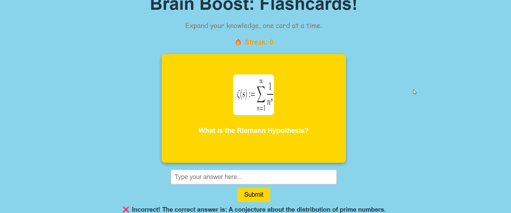

# Web Development Project 3 - FlashCards!

Submitted by: Rahat Moktadir

This web app:
**Brain Boost** is an interactive study tool designed to help users expand their knowledge across various subjects, including Computer Science, Environmental Science, Math, and History. Featuring a sleek and user-friendly interface, the app allows users to test their memory with visually engaging flashcards that include images, category-based colors, and a dynamic question-and-answer format.

Users can enter their guesses, receive instant feedback, and navigate through cards using next and previous buttons. Additional features include shuffle mode for randomized learning, streak tracking for progress monitoring, and the ability to mark mastered cards. With smooth animations and an intuitive design, **Brain Boost** makes studying fun and effective!

Time spent: 3 hours spent in total

## Required Features

The following **required** functionality is completed:

- [x] **The user can enter their guess in a box before seeing the flipside of the card**
- [x] **Clicking on a submit button shows visual feedback about whether the answer was correct or incorrect**
- [x] **A back button is displayed on the card and can be used to return to the previous card in a set sequence**
- [x] **A next button is displayed on the card and can be used to navigate to the next card in a set sequence**

The following **optional** features are implemented:

- [x] A shuffle button is used to randomize the order of the cards
- [x] A user's answer may be counted as correct even when it is slightly different from the target answer
- [x] A counter displays the user's current and longest streak of correct responses
- [x] A user can mark a card that they have mastered and have it removed from the pool of answers as well as added to a list of mastered cards

## Video Walkthrough

Here's a walkthrough of implemented required features:

GIF created with [LiceCap](https://www.cockos.com/licecap/)

## Notes

Some challenges encountered while building the app included **managing state for card flipping and navigation**, **ensuring images loaded correctly from the assets folder**, and **styling the UI to keep everything centered and visually appealing**. Additionally, implementing **category-based colors** and **hover effects** required careful CSS adjustments for a smooth user experience.

## License

    Copyright [yyyy] [name of copyright owner]

    Licensed under the Apache License, Version 2.0 (the "License");
    you may not use this file except in compliance with the License.
    You may obtain a copy of the License at

        http://www.apache.org/licenses/LICENSE-2.0

    Unless required by applicable law or agreed to in writing, software
    distributed under the License is distributed on an "AS IS" BASIS,
    WITHOUT WARRANTIES OR CONDITIONS OF ANY KIND, either express or implied.
    See the License for the specific language governing permissions and
    limitations under the License.
